# 基于 DNABERT2 的基因剪接位点三分类预测项目报告

项目名称：基于 DNA foundation model 的基因剪接位点预测算法

实现方案：DNABERT2 full fine-tuning，401 bp 转录方向窗口，全基因组 GENCODE transcript-level 剪接位点构造

报告日期：2026-06-20

## 摘要

本项目实现了一个面向人类基因组剪接位点的三分类预测系统。给定一个基因组候选位置，系统截取以该位置为中心、上下游各 200 bp、总长 401 bp 的 DNA 序列窗口，并将负链样本反向互补，使模型看到的输入统一为转录方向。模型输出三个类别的概率：

| label | 类别名 | 含义 |
|---:|---|---|
| 0 | `non_splice` | 非剪接位点 |
| 1 | `donor` | 供体剪接位点 |
| 2 | `acceptor` | 受体剪接位点 |

其中 `P(donor) + P(acceptor)` 可作为总体 splice-site probability，用于判断候选位置属于任意剪接位点的概率。

项目使用 `data/raw/GRCh38.p14.genome.fa` 与 `data/raw/gencode.v49.basic.annotation.gtf` 构建全基因组训练数据。正样本不是简单取 exon 端点，而是先按 `transcript_id` 分组解析 GTF exon，再按照转录方向排序 exon，由相邻 exon 推导 transcript-level intron，最后从 intron 两端生成 donor 与 acceptor 正样本。负样本包括随机基因组背景、真实基因组中具有 GT/AG motif 的困难负样本、以及 transcript-level intron 内部负样本。

主模型使用 HuggingFace 上的 `zhihan1996/DNABERT-2-117M`。DNABERT2 直接接收原始 DNA 字符串，本项目没有沿用旧 DNABERT 的手动 k-mer tokenization。训练方式为 full fine-tuning，使用两张 NVIDIA RTX PRO 6000 Blackwell Server Edition GPU 进行多 GPU 训练。

全量实验共构建 1,414,738 条样本，其中 `non_splice` 707,369 条、`donor` 351,969 条、`acceptor` 355,400 条。随机分层 full fine-tuning baseline 在测试集上达到 accuracy 0.966906、macro-F1 0.966328。三个类别的一对多 AUROC 均超过 0.994，AUPRC 均超过 0.993。按负样本类型分析，`motif_hard` 是当前最难负样本类型，其 accuracy 为 0.938709，说明模型在中心附近存在 GT/AG motif 的非注释位点上仍会发生更多混淆。

本轮扩展首先补充了对已有 full fine-tuning baseline 的可视化分析。可视化结果统一保存在 `outputs/visualizations/dnabert2_full_baseline/`，并嵌入到训练曲线、ROC/PR、混淆矩阵、负样本错误分析和中心序列模式等相关章节中。

随后新增 chromosome-held-out full fine-tuning 实验：valid 完全使用 `chr8`，test 完全使用 `chr9` 与 `chr10`，其余染色体和 GRCh38 alternate/unplaced contigs 用于 train。split 审计显示 train/valid/test 之间无染色体重叠。该严格切分实验在 held-out test 上达到 accuracy 0.967469、macro-F1 0.966799，未观察到相对随机分层 baseline 的性能下降。对应指标和可视化保存在 `outputs/dnabert2_chrom_holdout_full/` 与 `outputs/visualizations/dnabert2_chrom_holdout_full/`。

负样本消融实验进一步构建了 random-only 训练集：负样本只保留 `random_genome`，negative:positive ratio 仍为 1.0。该模型在自身 random-only test 上达到 macro-F1 0.972705，但在原始 full test 上为 0.966504，并且 `motif_hard` false-positive rate 从 full baseline 的 0.061291 升至 0.071004。结果说明只用随机负样本会高估模型表现，困难负样本对控制 GT/AG motif 附近假阳性具有实际价值。对应输出保存在 `outputs/dnabert2_ablation_random_only/` 与 `outputs/visualizations/dnabert2_ablation_random_only/`。

## 1. 任务定义

### 1.1 生物学背景

真核生物基因通常由 exon 与 intron 交替组成。转录后形成的 pre-mRNA 需要经过剪接过程去除 intron，并连接 exon，形成成熟 mRNA。剪接反应主要依赖 intron 两端的边界信号：

- donor site：通常位于 intron 的 5' 端，经典二核苷酸 motif 常为 GT。
- acceptor site：通常位于 intron 的 3' 端，经典二核苷酸 motif 常为 AG。

这些 motif 本身并不足以唯一决定剪接位点。人类基因组中存在大量非剪接位置也含有 GT 或 AG，因此如果只依赖中心二核苷酸，模型容易学到 shortcut。更合理的目标是让模型学习中心位点上下游序列上下文，以及 donor 与 acceptor 两类位点在转录方向上的差异。

### 1.2 机器学习任务

本项目将剪接位点预测建模为三分类任务。每条样本对应一个候选基因组位置，模型判断该位置属于：

- `non_splice`：非剪接位点。
- `donor`：供体剪接位点。
- `acceptor`：受体剪接位点。

输入序列为长度 401 bp 的 DNA window。候选位置位于窗口中心，下游和上游各 200 bp。这里的“上游”和“下游”指模型输入中的转录方向，而不是始终按参考基因组正向坐标解释。对于负链转录本，需要先从参考基因组截取窗口，再对窗口做 reverse complement。

### 1.3 输入与输出

模型训练和推理阶段的核心输入是 DNA 字符串：

```text
ACGT...  # 总长度 401 bp
```

每条样本保留以下关键信息：

| 字段 | 含义 |
|---|---|
| `chrom` | 染色体名，来自 FASTA/GTF 匹配后的名称 |
| `pos` | 候选中心位置，GTF 风格 1-based genomic coordinate |
| `strand` | `+` 或 `-`，表示转录本所在链 |
| `sequence` | 已按转录方向 orient 的 401 bp DNA 序列 |
| `window_start` | 原始基因组窗口起点，1-based inclusive |
| `window_end` | 原始基因组窗口终点，1-based inclusive |
| `label` | 数值标签，0/1/2 |
| `label_name` | `non_splice`、`donor` 或 `acceptor` |
| `site_type` | 正样本为 `donor`/`acceptor`，负样本为 `non_splice` |
| `negative_type` | 负样本类型，正样本为空字符串 |
| `gene_id` | GENCODE gene ID，正样本和 intronic 负样本保留 |
| `transcript_id` | GENCODE transcript ID，正样本和 intronic 负样本保留 |
| `intron_start` | transcript-level intron 起点，1-based inclusive |
| `intron_end` | transcript-level intron 终点，1-based inclusive |
| `intron_index` | 该 intron 在 transcript 内的顺序 |
| `n_transcripts` | 去重后该正样本位点关联的 transcript 数 |
| `n_genes` | 去重后该正样本位点关联的 gene 数 |

模型输出为三个类别的概率：

```json
{
  "non_splice": 0.01,
  "donor": 0.97,
  "acceptor": 0.02
}
```

推理脚本额外输出：

```text
splice_site_probability = P(donor) + P(acceptor)
```

该值用于把 donor 与 acceptor 合并为“是否为剪接位点”的总体概率。

## 2. 数据来源与文件说明

### 2.1 原始数据

项目默认原始数据位于 `data/raw/`：

| 文件 | 大小 | 用途 |
|---|---:|---|
| `data/raw/GRCh38.p14.genome.fa` | 3,346,463,894 bytes | 人类参考基因组 FASTA，用于截取 DNA window |
| `data/raw/GRCh38.p14.genome.fa.fai` | 24,370 bytes | FASTA index，供 pyfaidx 快速随机访问 |
| `data/raw/gencode.v49.basic.annotation.gtf` | 2,567,486,360 bytes | GENCODE v49 basic GTF，用于解析 exon/transcript/gene 注释 |

FASTA 与 GTF 坐标系统均对应 GRCh38.p14，避免了参考版本不一致造成的坐标错位。构建数据时会进行 chromosome 名称匹配，例如处理带 `chr` 前缀或不带 `chr` 前缀的情况。无法匹配到 FASTA 染色体名的 GTF exon 会被过滤。

### 2.2 坐标约定

GTF 使用 1-based inclusive 坐标。例如 GTF 中 `start=100, end=200` 表示包含第 100 到第 200 个碱基。

pyfaidx 切片使用 Python 风格的 0-based half-open 坐标。例如需要提取 1-based inclusive 区间 `[start_1based, end_1based]`，代码中实际使用：

```python
genome[chrom][start_1based - 1 : end_1based]
```

本项目把这些转换集中在 `src/sequence_utils.py` 的 `get_centered_window` 中，避免在多个脚本里重复手写坐标换算。

对于中心位置 `pos` 和窗口长度 `window_size=401`：

```text
flank = 401 // 2 = 200
window_start = pos - 200
window_end   = pos + 200
```

因此窗口包含中心位置本身，长度为 `window_end - window_start + 1 = 401`。

### 2.3 正负链方向统一

模型输入应统一为转录方向。正链 transcript 的转录方向与参考基因组坐标方向一致，因此直接截取窗口即可。负链 transcript 的转录方向与参考基因组坐标方向相反，因此需要先按 genomic coordinate 截取窗口，再 reverse complement。

示意如下：

| strand | 截取方式 | 模型看到的方向 |
|---|---|---|
| `+` | 直接取 `[pos-200, pos+200]` | 参考基因组正向，也是转录方向 |
| `-` | 取 `[pos-200, pos+200]` 后 reverse complement | 转录方向 |

这一点很重要。如果不做方向统一，模型会同时看到正向 donor motif 与负链反向互补后的 motif，类别边界会变得不一致。

## 3. 数据集构建方法

数据集构建入口为：

```bash
python -m src.build_splice_dataset --config configs/dataset.yaml
```

主配置文件为 `configs/dataset.yaml`：

```yaml
seed: 42
window_size: 401

raw:
  fasta: data/raw/GRCh38.p14.genome.fa
  gtf: data/raw/gencode.v49.basic.annotation.gtf

output:
  dataset_dir: data/processed/dnabert2_splice_401

limits:
  max_transcripts:
  max_gtf_lines:

negatives:
  negative_to_positive_ratio: 1.0
  type_fractions:
    random_genome: 0.3334
    motif_hard: 0.3333
    intronic: 0.3333
  min_distance_to_splice: 200
  intronic_margin: 200

split:
  valid_size: 0.1
  test_size: 0.1
  stratify_column: stratify_key
```

### 3.1 GTF exon 解析

实现位置：`src/gtf_utils.py`

核心函数：

- `parse_gtf_attributes`
- `parse_exons_by_transcript`
- `transcript_introns`
- `derive_introns`
- `positive_site_records`
- `deduplicate_positive_records`

GTF 第 9 列 attribute 中包含 `gene_id`、`transcript_id`、`exon_number` 等信息。项目逐行读取 GTF，仅保留 feature 为 `exon` 的记录，并根据 `transcript_id` 分组。

解析时的主要过滤逻辑：

- 跳过注释行。
- 跳过字段数不为 9 的异常行。
- 只保留 `feature == "exon"` 的记录。
- 跳过缺少 `transcript_id` 或 `gene_id` 的记录。
- 跳过 chromosome 名称无法在 FASTA 中匹配的记录。
- smoke 配置可用 `max_transcripts` 或 `max_gtf_lines` 限制规模。

### 3.2 transcript-level intron 推导

本项目没有把每个 exon 的两个端点都直接当作剪接位点。这样做会把 transcript 第一个 exon 的起点、最后一个 exon 的终点也混入正样本，而这些边界不一定是 intron splice junction。更严谨的做法是根据 transcript 内相邻 exon 推导 intron。

对于一个 transcript：

1. 收集该 transcript 的所有 exon。
2. 确认这些 exon 在同一染色体、同一 strand。
3. 按转录方向排序：
   - `+` strand：按 exon genomic start 从小到大排序。
   - `-` strand：按 exon genomic start 从大到小排序。
4. 对排序后相邻 exon 两两配对。
5. 由两个相邻 exon 之间的 genomic gap 推导 intron。

代码中的 intron genomic coordinate 使用：

```python
genomic_start = min(left_tx_exon.end, right_tx_exon.end) + 1
genomic_end = max(left_tx_exon.start, right_tx_exon.start) - 1
```

如果 `genomic_start > genomic_end`，说明两个 exon 重叠或相邻，无法形成有效 intron，跳过该 pair。

### 3.3 donor 与 acceptor 正样本锚点

对每个 transcript-level intron，生成两个正样本：

- donor：供体剪接位点。
- acceptor：受体剪接位点。

本项目采用 intron motif 侧坐标作为中心锚点：

| strand | donor `pos` | acceptor `pos` |
|---|---:|---:|
| `+` | `intron_start` | `intron_end` |
| `-` | `intron_end` | `intron_start` |

这样定义后，在序列被 orient 到转录方向时，模型看到的 donor 与 acceptor 都处于一致的生物学方向。

每个正样本保留：

- `chrom`
- `pos`
- `strand`
- `gene_id`
- `transcript_id`
- `intron_start`
- `intron_end`
- `intron_index`
- `site_type`
- `label`
- `label_name`

### 3.4 正样本去重

同一个 genomic splice site 可能被多个 transcript 或多个 gene annotation 共享。如果直接保留所有 transcript-level 记录，会导致共享位点在训练集中重复出现，从而改变样本权重。

项目按以下 key 去重：

```text
(chrom, pos, strand, site_type)
```

这里保留 `site_type` 是为了避免 donor 与 acceptor 被错误合并。去重后，代码会把共享该位点的 transcript 和 gene 聚合到字符串字段中，并记录：

- `n_transcripts`
- `n_genes`

这一设计兼顾了两个目标：

1. 避免同一位点重复计入训练。
2. 保留位点可追溯性，方便后续分析 isoform 共享情况。

### 3.5 正样本窗口过滤

对去重后的正样本，使用 FASTA 截取 401 bp window。以下情况会被过滤：

- 窗口越过染色体边界。
- chromosome 不在 FASTA 中。
- 截取结果长度不是 401 bp。
- 序列包含非 A/C/G/T 字符，例如 `N`。

全量数据中，正样本窗口过滤结果为：

| 项目 | 数量 |
|---|---:|
| 去重后正样本候选数 | 707,378 |
| 成功保留 | 707,369 |
| 因含 N 丢弃 | 9 |

### 3.6 负样本设计

负样本全部标为：

```text
label = 0
label_name = non_splice
site_type = non_splice
```

但保留 `negative_type` 字段，以便训练后按负样本难度分析模型错误。

默认设置为负样本总量等于正样本总量，即 `negative_to_positive_ratio = 1.0`。三类负样本约各占三分之一。

#### 3.6.1 random_genome

`random_genome` 是随机基因组背景负样本。采样方法：

1. 按染色体长度加权随机选择 chromosome。
2. 随机选择一个不会造成 401 bp 窗口越界的中心位置。
3. 随机选择 `+` 或 `-` strand。
4. 要求该位置距离任意已注释正样本剪接位点大于 `min_distance_to_splice`。
5. 截取窗口并过滤含 `N` 的序列。

该负样本用于提供一般背景序列。

#### 3.6.2 motif_hard

`motif_hard` 是真实基因组中的 motif 困难负样本。与旧报告中的人工插入 GT/AG decoy 不同，本项目没有人工改写序列，而是在真实基因组中寻找中心附近已经具有 donor-like 或 acceptor-like motif 的位置。

判断逻辑位于 `src/sequence_utils.py` 的 `has_splice_like_motif`：

```python
donor_like = sequence[center_index : center_index + 2] == "GT"
acceptor_like = sequence[center_index - 1 : center_index + 1] == "AG"
```

候选位置仍必须满足：

- 不是已注释 splice site。
- 距离已注释 splice site 至少 200 bp。
- 401 bp 窗口完整。
- 序列不含 `N`。

该负样本最能检验模型是否只看中心 GT/AG motif。若模型只学到简单 motif 规则，就会在这一组上产生大量假阳性。

#### 3.6.3 intronic

`intronic` 是 transcript-level intron 内部负样本。采样方法：

1. 从已经推导出的 transcript-level intron 中选择足够长的 intron。
2. 在 intron 内部采样中心位置。
3. 要求距离 intron 两端至少 `intronic_margin = 200 bp`。
4. 同时要求距离任何已注释剪接位点至少 `min_distance_to_splice = 200 bp`。
5. 截取 401 bp 窗口并过滤含 `N` 的序列。

该负样本代表真实基因结构内部的非边界位置，难度高于完全随机背景。

### 3.7 负样本去重与距离过滤

负样本使用 key：

```text
(chrom, pos, strand)
```

避免重复采样同一位置和方向。负样本还使用已知正样本位点索引进行距离过滤。代码按 chromosome 建立已注释 splice site 的排序坐标列表，并用二分查找判断候选位置是否离任意 splice site 过近。

距离过滤函数位于 `src/build_splice_dataset.py`：

```python
near_known_site(chrom, pos, known_index, min_distance)
```

这样可以降低把未充分远离 annotation 边界的位置误当作负样本的风险。

### 3.8 数据划分

首版 baseline 使用随机分层划分：

- train：80%
- valid：10%
- test：10%

分层字段默认为 `stratify_key`：

- 正样本使用 `label_name`，即 `donor` 或 `acceptor`。
- 负样本使用 `negative_type`，即 `random_genome`、`motif_hard` 或 `intronic`。

这样划分不仅保持三分类 label 比例，也尽量保持三类负样本比例。

负样本消融实验沿用随机分层划分，但通过配置中的 `negatives.enabled_types` 只启用 `random_genome`：

```yaml
negatives:
  negative_to_positive_ratio: 1.0
  enabled_types: [random_genome]
```

这样可以把“正样本构建、窗口长度、训练超参数”保持不变，只改变训练时看到的负样本难度。random-only 数据集自身的 train/valid/test 都只包含随机背景负样本；为了衡量它对困难负样本的真实泛化能力，训练后额外用原始 full test 重新推理并生成 `full_test_metrics.json` 与 `full_test_predictions.parquet`。

扩展实验增加了第二种划分策略 `chromosome_holdout`，配置文件为 `configs/dataset_chrom_holdout.yaml`：

```yaml
split:
  strategy: chromosome_holdout
  valid_chroms: [chr8]
  test_chroms: [chr9, chr10]
```

该策略直接按 `chrom` 字段划分：`chr8` 全部进入 validation，`chr9` 与 `chr10` 全部进入 test，其余染色体进入 train。构建后会额外输出 `split_summary.json`，记录 split size、label counts、negative-type counts、每个 split 的染色体列表和染色体重叠审计。当前审计结果为 `has_chrom_overlap = false`，即 train/valid/test 之间没有染色体泄漏。

## 4. 全量数据集统计

全量数据集输出目录：

```text
data/processed/dnabert2_splice_401/
```

主要输出文件：

| 文件 | 用途 |
|---|---|
| `dataset_dict.json` | HuggingFace DatasetDict 元信息 |
| `train.parquet` | 训练集表格 |
| `valid.parquet` | 验证集表格 |
| `test.parquet` | 测试集表格 |
| `summary.json` | 数据规模、label 分布、过滤统计 |

### 4.1 总体规模

| 指标 | 数值 |
|---|---:|
| window size | 401 |
| transcript 数 | 280,000 |
| transcript-level intron 数 | 2,245,461 |
| 正样本候选数 | 707,378 |
| 正样本保留数 | 707,369 |
| 总样本数 | 1,414,738 |

### 4.2 label 分布

| label | 类别名 | 数量 | 占比 |
|---:|---|---:|---:|
| 0 | `non_splice` | 707,369 | 50.00% |
| 1 | `donor` | 351,969 | 24.88% |
| 2 | `acceptor` | 355,400 | 25.12% |
|  | 合计 | 1,414,738 | 100.00% |

正样本与负样本总体接近 1:1。donor 与 acceptor 数量略有差异，主要来自不同 transcript/intron 在去重后共享情况不同，以及少量窗口过滤。

### 4.3 负样本类型分布

| negative_type | 数量 | 设计目的 |
|---|---:|---|
| `random_genome` | 235,837 | 普通基因组背景 |
| `motif_hard` | 235,766 | 含 GT/AG motif 但非注释剪接位点 |
| `intronic` | 235,766 | intron 内部、远离 intron 两端的位置 |

三类负样本比例基本一致，避免训练集被某一类负样本主导。

### 4.4 train/valid/test 划分

| split | 总数 | non_splice | donor | acceptor |
|---|---:|---:|---:|---:|
| train | 1,131,790 | 565,895 | 281,575 | 284,320 |
| valid | 141,474 | 70,737 | 35,197 | 35,540 |
| test | 141,474 | 70,737 | 35,197 | 35,540 |

valid 与 test 分布一致，说明随机分层划分保持了稳定的类别比例。

### 4.5 chromosome-held-out 划分审计

chromosome-held-out 数据集输出目录：

```text
data/processed/dnabert2_splice_401_chrom_holdout/
```

该数据集复用同一批 1,414,738 条样本，仅改变 split 策略。留出染色体如下：

| split | 染色体策略 | 染色体重叠 |
|---|---|---|
| train | 排除 `chr8`、`chr9`、`chr10`，保留其余染色体和 GRCh38 alternate/unplaced contigs | 无 |
| valid | `chr8` | 无 |
| test | `chr9`、`chr10` | 无 |

split 审计表如下：

| split | 总数 | non_splice | donor | acceptor | random_genome | motif_hard | intronic |
|---|---:|---:|---:|---:|---:|---:|---:|
| train | 1,237,144 | 616,040 | 308,989 | 312,115 | 205,721 | 205,666 | 204,653 |
| valid | 57,371 | 30,313 | 13,541 | 13,517 | 10,981 | 10,929 | 8,403 |
| test | 120,223 | 61,016 | 29,439 | 29,768 | 19,135 | 19,171 | 22,710 |

与随机分层 split 不同，held-out test 的类别和负样本类型比例由 `chr9/chr10` 上的真实样本分布决定，因此不强行与 train/valid 完全一致。这更接近“训练时未见过整条染色体”的泛化评估。

## 5. 模型方案

### 5.1 选择 DNABERT2 的理由

DNABERT2 是面向 DNA 序列的 foundation model。相比旧版 DNABERT 需要把 DNA 序列手动切成固定 k-mer 字符串，DNABERT2 tokenizer 可以直接处理原始 DNA 字符串。本项目输入为 401 bp 原始 DNA，因此使用 DNABERT2 可以简化预处理流程，并减少 k-mer 长度选择带来的额外超参数。

模型配置：

```yaml
model:
  name_or_path: zhihan1996/DNABERT-2-117M
  trust_remote_code: true
  disable_triton_flash_attention: true
```

训练脚本使用：

```python
AutoTokenizer.from_pretrained(model_name, trust_remote_code=True)
AutoModelForSequenceClassification.from_pretrained(
    model_name,
    trust_remote_code=True,
    num_labels=3,
    id2label=id2label,
    label2id=label2id,
)
```

`num_labels=3` 对应三分类任务。`id2label` 与 `label2id` 显式写入模型配置，便于训练后推理和模型保存。

### 5.2 full fine-tuning

本项目首要实验不是 frozen embedding 或 linear probe，而是 full fine-tuning。也就是说，DNABERT2 主干参数和分类头一起参与训练。

选择 full fine-tuning 的原因：

- 数据规模达到百万级，足以支持更新大模型参数。
- 剪接位点识别需要建模较细的局部序列模式和上下文组合。
- donor、acceptor、non_splice 三类的边界不只是简单 motif 区分，尤其是 motif_hard 负样本要求模型更充分适配任务。
- 当前服务器具备两张大显存 GPU，资源条件支持 full fine-tuning。

### 5.3 tokenization

DNABERT2 输入为原始 DNA sequence：

```python
tokenized = tokenizer(
    batch["sequence"],
    truncation=True,
    padding="max_length",
    max_length=512,
)
```

因为 DNA window 长度为 401 bp，配置中 `max_length=512` 足够容纳序列和特殊 token。项目没有执行旧 DNABERT 的：

```text
ACGTACGT -> ACG CGT GTA TAC ...
```

这种手动 k-mer tokenization。

### 5.4 训练配置

主训练配置文件为 `configs/dnabert2_full.yaml`：

| 参数 | 取值 | 说明 |
|---|---:|---|
| `learning_rate` | `2.0e-5` | BERT 类 full fine-tuning 常用小学习率 |
| `num_train_epochs` | `3` | 在百万级数据上进行完整三轮训练 |
| `per_device_train_batch_size` | `64` | 每张 GPU 的训练 batch size |
| `per_device_eval_batch_size` | `128` | 每张 GPU 的评估 batch size |
| `gradient_accumulation_steps` | `1` | 不做梯度累积 |
| `warmup_ratio` | `0.05` | 前 5% step warmup，降低训练初期不稳定 |
| `weight_decay` | `0.01` | 轻量正则化 |
| `eval_steps` | `1000` | 每 1000 step 在验证集评估 |
| `save_steps` | `1000` | 每 1000 step 保存 checkpoint |
| `metric_for_best_model` | `macro_f1` | 以宏平均 F1 选择最佳模型 |
| `bf16` | `true` | 在支持的 GPU 上使用 bf16 |
| `fp16` | `false` | 不使用 fp16 |
| `dataloader_num_workers` | `8` | 并行加载数据 |
| `eval_accumulation_steps` | `16` | 减少评估时显存峰值 |
| `save_total_limit` | `3` | 最多保留 3 个 checkpoint |

### 5.5 禁用远程 Triton flash attention

DNABERT2 的 HuggingFace remote code 中包含 Triton flash attention 相关实现。当前环境中的 Triton API 与上游 remote code 的目标版本可能不完全兼容。项目在 `src/model_utils.py` 中提供 `disable_remote_flash_attention`，默认通过配置启用：

```yaml
disable_triton_flash_attention: true
```

这样做的目的不是改变模型结构，而是避免训练时调用不兼容的 remote kernel。保存最终模型时，项目还会把 remote model code 中的若干 Python 文件复制到 `final_model`，提高后续推理复现性。

### 5.6 多 GPU 训练

全量训练使用 `torchrun`：

```bash
torchrun --nproc_per_node=2 -m src.train_dnabert2 --config configs/dnabert2_full.yaml
```

实际运行时使用 conda 环境和 HuggingFace cache：

```bash
PYTORCH_CUDA_ALLOC_CONF=expandable_segments:True \
HF_HOME=/home/ubuntu/clin-jepa/final-project/.cache/huggingface \
conda run --no-capture-output -n dna-fine-tune \
torchrun --nproc_per_node=2 -m src.train_dnabert2 --config configs/dnabert2_full.yaml
```

训练脚本启动时会记录：

- PyTorch 版本。
- CUDA runtime。
- CUDA 是否可用。
- GPU 数量。
- GPU 名称。
- 分布式 world size 与 rank。

## 6. 训练与评估实现

### 6.1 训练入口

训练入口为：

```bash
python -m src.train_dnabert2 --config configs/dnabert2_full.yaml
```

多 GPU 训练入口为：

```bash
torchrun --nproc_per_node=2 -m src.train_dnabert2 --config configs/dnabert2_full.yaml
```

训练流程：

1. 读取 YAML 配置。
2. 设置随机种子。
3. 打印 CUDA 和分布式运行环境。
4. 从 `data/processed/dnabert2_splice_401` 加载 DatasetDict。
5. 打印 train/valid/test 的样本量和 label 分布。
6. 加载 DNABERT2 tokenizer。
7. 对 raw DNA sequence 做 tokenizer 编码。
8. 加载 DNABERT2 sequence classification model。
9. 构建 HuggingFace `TrainingArguments`。
10. 创建 `Trainer`。
11. full fine-tuning。
12. 保存 best checkpoint、final model、tokenizer、trainer state。
13. 在 valid/test 上评估。
14. 输出 `metrics.json`、`test_metrics.json`、`test_predictions.parquet`。

### 6.2 metrics 实现

指标实现位于 `src/metrics_utils.py`。主要指标包括：

- accuracy。
- macro-F1。
- per-class precision/recall/F1/support。
- confusion matrix。
- one-vs-rest AUROC。
- one-vs-rest AUPRC。

对于某些分组评估，例如只看负样本时，分组内可能只有 `non_splice` 一类真实标签。此时 AUROC/AUPRC 无法定义，代码会输出 `null`，而不是中断程序。

### 6.3 预测表

测试集预测输出为：

```text
outputs/dnabert2_full/test_predictions.parquet
```

该表在原始 test split 字段基础上增加：

| 字段 | 含义 |
|---|---|
| `prob_0_non_splice` | 模型预测为 non_splice 的概率 |
| `prob_1_donor` | 模型预测为 donor 的概率 |
| `prob_2_acceptor` | 模型预测为 acceptor 的概率 |
| `pred_label` | 概率最大的类别编号 |
| `splice_site_probability` | `prob_1_donor + prob_2_acceptor` |

该预测表既可用于统一评估，也可用于后续可视化、错误分析、阈值选择和案例追踪。

## 7. 实测训练结果

### 7.1 训练运行概况

本节先给出随机分层 full fine-tuning baseline，再给出 chromosome-held-out full fine-tuning 和 random-only 负样本消融。三组均使用 DNABERT2 full fine-tuning、401 bp 输入窗口和相同训练超参数；差异分别来自数据 split 与训练负样本构成。

训练输出目录：

```text
outputs/dnabert2_full/
```

关键产物：

| 文件 | 用途 |
|---|---|
| `outputs/dnabert2_full/checkpoints/trainer_state.json` | Trainer 状态与训练日志 |
| `outputs/dnabert2_full/final_model/model.safetensors` | 最终模型权重 |
| `outputs/dnabert2_full/final_model/tokenizer.json` | tokenizer |
| `outputs/dnabert2_full/metrics.json` | train/valid/test 指标汇总 |
| `outputs/dnabert2_full/test_metrics.json` | test 指标 |
| `outputs/dnabert2_full/test_predictions.parquet` | test 预测明细 |
| `outputs/dnabert2_full/eval_metrics.json` | 统一评估脚本输出 |

训练统计：

| 指标 | 数值 |
|---|---:|
| epoch | 3.0 |
| global step | 26,529 |
| best checkpoint | `checkpoint-26000` |
| best validation macro-F1 | 0.966565 |
| train runtime | 7,367.8533 秒 |
| train samples/second | 460.836 |
| train steps/second | 3.601 |
| train loss | 0.138921 |

训练曲线显示，模型在前 2,000 step 已经快速达到较高验证集 macro-F1，随后继续稳步提升，最佳验证集 macro-F1 出现在 step 26,000。对应可视化文件为 [`training_curves.png`](../outputs/visualizations/dnabert2_full_baseline/training_curves.png)。

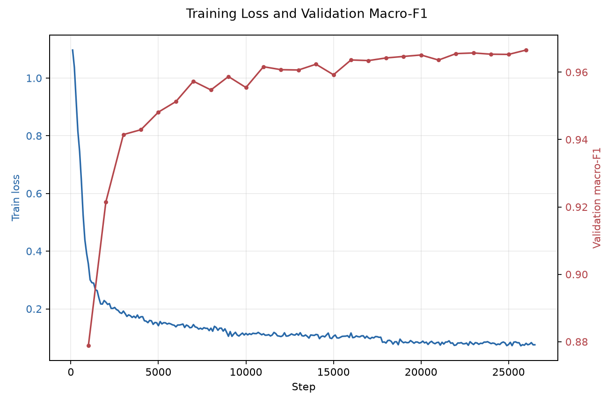

### 7.2 验证集结果

| 指标 | 数值 |
|---|---:|
| validation accuracy | 0.967174 |
| validation macro-F1 | 0.966565 |
| validation loss | 0.104351 |
| validation AUROC non_splice | 0.994638 |
| validation AUROC donor | 0.997325 |
| validation AUROC acceptor | 0.997198 |
| validation AUPRC non_splice | 0.994283 |
| validation AUPRC donor | 0.993452 |
| validation AUPRC acceptor | 0.993115 |

验证集上三个类别 F1 分别为：

| 类别 | precision | recall | F1 |
|---|---:|---:|---:|
| non_splice | 0.975027 | 0.963145 | 0.969050 |
| donor | 0.959098 | 0.972015 | 0.965513 |
| acceptor | 0.959920 | 0.970400 | 0.965131 |

### 7.3 测试集总体结果

| 指标 | 数值 |
|---|---:|
| test accuracy | 0.966906 |
| test macro-F1 | 0.966328 |
| test AUROC non_splice | 0.994666 |
| test AUROC donor | 0.997210 |
| test AUROC acceptor | 0.997111 |
| test AUPRC non_splice | 0.994301 |
| test AUPRC donor | 0.993215 |
| test AUPRC acceptor | 0.993107 |

ROC 与 PR 曲线进一步说明，三个类别在阈值无关指标上均表现稳定。`donor` 与 `acceptor` 的 ROC 曲线几乎贴近左上角，PR 曲线也保持在高 precision 区间；`non_splice` 虽然占比更高，但在困难负样本干扰下仍维持 0.994 以上 AUROC。


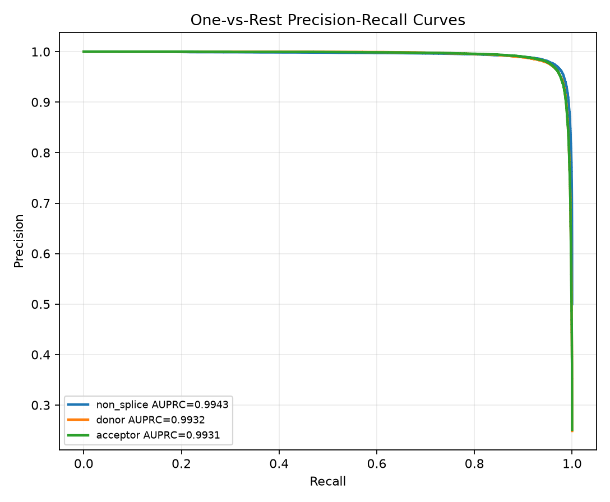

### 7.4 测试集 per-class 指标

| 类别 | support | precision | recall | F1 |
|---|---:|---:|---:|---:|
| non_splice | 70,737 | 0.975828 | 0.961647 | 0.968685 |
| donor | 35,197 | 0.955916 | 0.973407 | 0.964582 |
| acceptor | 35,540 | 0.960556 | 0.970934 | 0.965717 |

从 per-class 指标看，三类性能较均衡。`non_splice` precision 最高，说明被预测为非剪接位点的样本中大多数确为负样本。donor 与 acceptor recall 均超过 0.970，说明模型对真实剪接位点具有较高召回能力。

### 7.5 混淆矩阵

行表示真实类别，列表示预测类别。类别顺序为 `non_splice`、`donor`、`acceptor`。

| true \ pred | non_splice | donor | acceptor |
|---|---:|---:|---:|
| non_splice | 68,024 | 1,408 | 1,305 |
| donor | 824 | 34,261 | 112 |
| acceptor | 861 | 172 | 34,507 |


主要错误类型：

- 真实 `non_splice` 被误报为 donor：1,408。
- 真实 `non_splice` 被误报为 acceptor：1,305。
- 真实 donor 被误判为 non_splice：824。
- 真实 acceptor 被误判为 non_splice：861。
- donor 与 acceptor 之间的互相混淆较少：donor -> acceptor 为 112，acceptor -> donor 为 172。

这说明模型更主要的挑战是“剪接位点 vs 非剪接位点”的边界，而不是 donor 与 acceptor 之间的方向性区分。

### 7.6 按负样本类型的表现

统一评估脚本 `src.evaluate` 支持按 `negative_type` 分组评估负样本。因为每个 negative group 内真实标签只有 `non_splice`，所以 AUROC/AUPRC 在这些分组中不可定义，输出为 `null`。分组 accuracy 可理解为该类负样本被正确识别为 `non_splice` 的比例。

| negative_type | support | 正确识别为 non_splice | 误报 donor | 误报 acceptor | accuracy |
|---|---:|---:|---:|---:|---:|
| intronic | 23,577 | 23,000 | 316 | 261 | 0.975527 |
| motif_hard | 23,576 | 22,131 | 766 | 679 | 0.938709 |
| random_genome | 23,584 | 22,893 | 326 | 365 | 0.970700 |

`motif_hard` 是最难负样本类型。它的错误数明显高于 `random_genome` 和 `intronic`，这符合预期：这些样本中心附近具有 GT/AG motif，但不是已注释剪接位点。模型在这类位置上更容易给出 donor 或 acceptor 假阳性。

从平均 splice-site probability 看：

| negative_type | mean splice-site probability |
|---|---:|
| intronic | 0.038321 |
| motif_hard | 0.078179 |
| random_genome | 0.041681 |

`motif_hard` 的平均 splice-site probability 最高，进一步说明中心 motif 对模型预测仍有影响，但模型整体仍能正确识别 93.87% 的 motif_hard 负样本。

从概率分布看，donor/acceptor 正样本的 splice-site probability 明显集中在高分区间，而三类负样本大多集中在低分区间。`motif_hard` 的右尾更长，说明少量带 GT/AG motif 的非注释位点会被模型赋予接近真实剪接位点的概率。

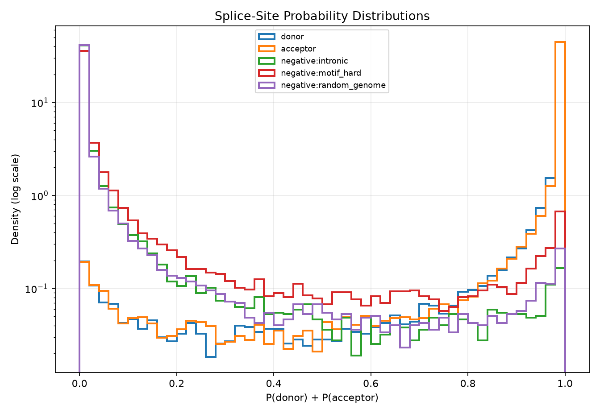

可视化脚本额外输出了更直接的负样本误报率表，文件见 [`negative_type_summary.csv`](../outputs/visualizations/dnabert2_full_baseline/negative_type_summary.csv) 与 [`negative_type_summary.md`](../outputs/visualizations/dnabert2_full_baseline/negative_type_summary.md)。

| negative_type | n | accuracy | false_positive_rate | donor_fp | acceptor_fp | mean_splice_site_probability | median_splice_site_probability | max_splice_site_probability |
|---|---:|---:|---:|---:|---:|---:|---:|---:|
| motif_hard | 23,576 | 0.938709 | 0.061291 | 766 | 679 | 0.078179 | 0.004315 | 0.999842 |
| random_genome | 23,584 | 0.970700 | 0.029300 | 326 | 365 | 0.041681 | 0.001874 | 0.999803 |
| intronic | 23,577 | 0.975527 | 0.024473 | 316 | 261 | 0.038321 | 0.002500 | 0.999704 |

高置信度 `motif_hard` 假阳性案例集中表现出接近 canonical acceptor/donor 的局部序列。Top 100 案例保存为 [`motif_hard_false_positives_top100.csv`](../outputs/visualizations/dnabert2_full_baseline/motif_hard_false_positives_top100.csv)，Top 20 Markdown 表保存为 [`motif_hard_false_positives_top20.md`](../outputs/visualizations/dnabert2_full_baseline/motif_hard_false_positives_top20.md)。下表展示前 5 个案例，`sequence` 列只截取中心附近 41 bp：

| chrom | pos | strand | pred_label | splice_site_probability | center sequence |
|---|---:|---|---:|---:|---|
| GL000256.2 | 1,560,068 | + | 2 | 0.999842 | `CCTCCCTCTCCTTTCCCAGAGCCGTCTTCTCAGCCCACCAT` |
| chr11 | 121,513,788 | - | 2 | 0.999806 | `TTCCCTTTATTTTTCCTAAGGTGACCAAAGGAAAGCAGAAT` |
| chr8 | 46,029,737 | + | 1 | 0.999783 | `GTGACCGCAATACCCAAACCGTGAGTCGAAGTCTTCTCGAG` |
| chr1 | 26,816,453 | - | 2 | 0.999758 | `ACTTCTTTGTTACGTGCTAGGTCAAGATAATCAAGGTCTCT` |
| chr2 | 212,996,464 | - | 2 | 0.999755 | `CCTTATGTTGTCTATCCTTAGGAATGAGACATGTACTACCA` |

### 7.7 中心序列模式可视化

为了检查模型是否至少学到了合理的剪接位点局部模式，项目对测试集按真实类别抽样并统计中心上下游 20 bp 的 A/C/G/T 频率。图中 donor 在中心附近呈现明显 `GT` 倾向，acceptor 在中心附近呈现 `AG` 与上游富 T/C 的模式；`non_splice` 的中心模式更分散。这与剪接位点的经典生物学信号一致，也解释了为什么 `motif_hard` 会成为最难负样本：它们局部 motif 像正样本，但缺少完整上下文支持。


### 7.8 chromosome-held-out full fine-tuning 结果

chromosome-held-out 实验输出目录：

```text
outputs/dnabert2_chrom_holdout_full/
```

该实验使用 `chr8` 作为 validation，`chr9` 与 `chr10` 作为 test，训练集不包含这些染色体。训练完成后最佳验证 checkpoint 为 `checkpoint-28000`，训练 runtime 为 6,709.747 秒，最终模型目录大小约 447 MiB，最佳 checkpoint 目录约 1.34 GiB。

训练曲线显示，模型在第一 epoch 内快速达到 0.95 以上 validation macro-F1，第二、第三 epoch 继续小幅提升，最佳 validation macro-F1 出现在 step 28,000。

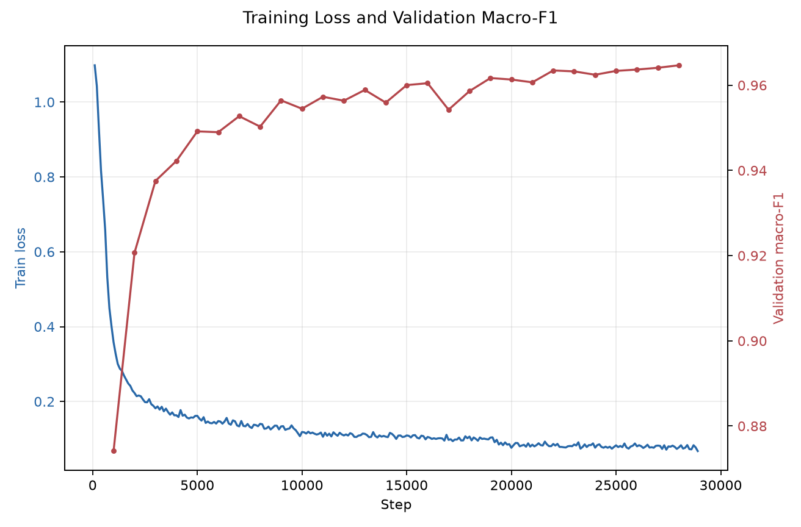

held-out test 结果如下：

| 实验 | split | test accuracy | test macro-F1 | AUROC non_splice | AUROC donor | AUROC acceptor | AUPRC non_splice | AUPRC donor | AUPRC acceptor | train runtime |
|---|---|---:|---:|---:|---:|---:|---:|---:|---:|---:|
| full baseline | random stratified | 0.966906 | 0.966328 | 0.994666 | 0.997210 | 0.997111 | 0.994301 | 0.993215 | 0.993107 | 7,367.853 s |
| full holdout | chr8 valid, chr9/chr10 test | 0.967469 | 0.966799 | 0.994865 | 0.997433 | 0.997181 | 0.994602 | 0.993759 | 0.993162 | 6,709.747 s |

在这个具体留出方案下，held-out test 没有出现预期中的明显性能下降，accuracy 与 macro-F1 均略高于随机分层 baseline。这说明当前模型并非只依赖同染色体相似窗口取得高分；不过该结论仍限于 `chr8/chr9/chr10` 这一组留出染色体，不能替代更多 chromosome fold 或外部数据验证。

ROC 与 PR 曲线如下：

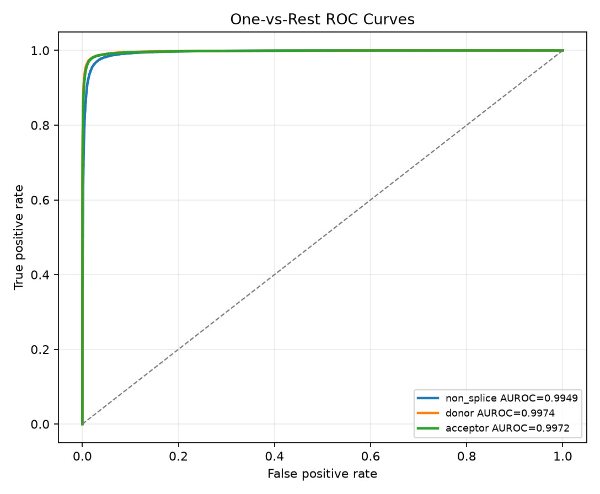


held-out test 的混淆矩阵为：

| true \ pred | non_splice | donor | acceptor |
|---|---:|---:|---:|
| non_splice | 58,743 | 1,061 | 1,212 |
| donor | 716 | 28,614 | 109 |
| acceptor | 716 | 97 | 28,955 |


按负样本类型看，`motif_hard` 仍然是最难负样本，false-positive rate 为 5.96%；`random_genome` 与 `intronic` 分别为 2.73% 与 2.67%。这与随机分层 baseline 的模式一致，说明跨染色体切分没有改变主要错误来源。

| negative_type | n | accuracy | false_positive_rate | donor_fp | acceptor_fp | mean_splice_site_probability |
|---|---:|---:|---:|---:|---:|---:|
| motif_hard | 19,171 | 0.940379 | 0.059621 | 550 | 593 | 0.077330 |
| random_genome | 19,135 | 0.972668 | 0.027332 | 225 | 298 | 0.039682 |
| intronic | 22,710 | 0.973272 | 0.026728 | 286 | 321 | 0.040298 |

完整负样本表见 [`negative_type_summary.csv`](../outputs/visualizations/dnabert2_chrom_holdout_full/negative_type_summary.csv)，高置信度 `motif_hard` 假阳性案例见 [`motif_hard_false_positives_top100.csv`](../outputs/visualizations/dnabert2_chrom_holdout_full/motif_hard_false_positives_top100.csv) 与 [`motif_hard_false_positives_top20.md`](../outputs/visualizations/dnabert2_chrom_holdout_full/motif_hard_false_positives_top20.md)。

splice-site probability 分布和中心序列频率图如下。前者显示 `motif_hard` 负样本仍有更长右尾；后者显示 held-out 染色体上的 donor/acceptor 中心 motif 与随机 split baseline 一致。

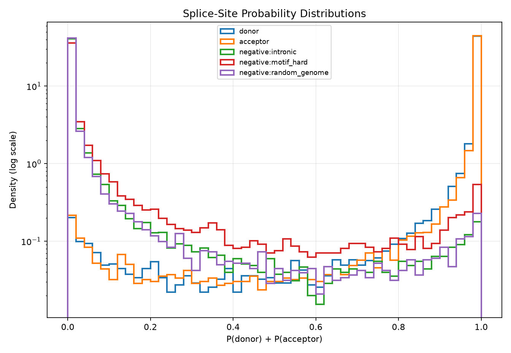

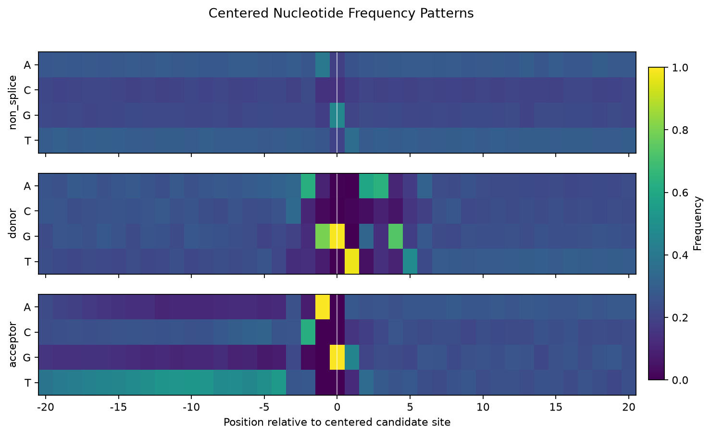

### 7.9 random-only 负样本消融结果

random-only 消融实验输出目录：

```text
outputs/dnabert2_ablation_random_only/
```

该实验重新构建全量数据集，但负样本只启用 `random_genome`，并保持 negative:positive ratio 为 1.0。数据集规模仍为 1,414,738 条，其中 `non_splice` 707,369 条、`donor` 351,969 条、`acceptor` 355,400 条；区别是所有负样本均为随机基因组背景。训练完成后最佳验证 checkpoint 为 `checkpoint-26000`，训练 runtime 为 7,345.236 秒，最终模型目录大小约 448 MiB。

在 random-only 自身 test 上，模型得到较高指标：

| test set | accuracy | macro-F1 | AUROC non_splice | AUROC donor | AUROC acceptor | AUPRC non_splice | AUPRC donor | AUPRC acceptor |
|---|---:|---:|---:|---:|---:|---:|---:|---:|
| random-only test | 0.973352 | 0.972705 | 0.996450 | 0.998049 | 0.997910 | 0.996247 | 0.995211 | 0.995052 |
| original full test | 0.967033 | 0.966504 | 0.994975 | 0.997355 | 0.997293 | 0.994583 | 0.993481 | 0.993607 |

这个差异是消融实验的核心结论：如果测试集也只包含随机负样本，模型表现会被明显高估；当同一个模型放回包含 `motif_hard` 与 `intronic` 的原始 full test，macro-F1 回到与 full baseline 接近的区间。

通用 full test 上的训练曲线、ROC 与 PR 曲线如下：

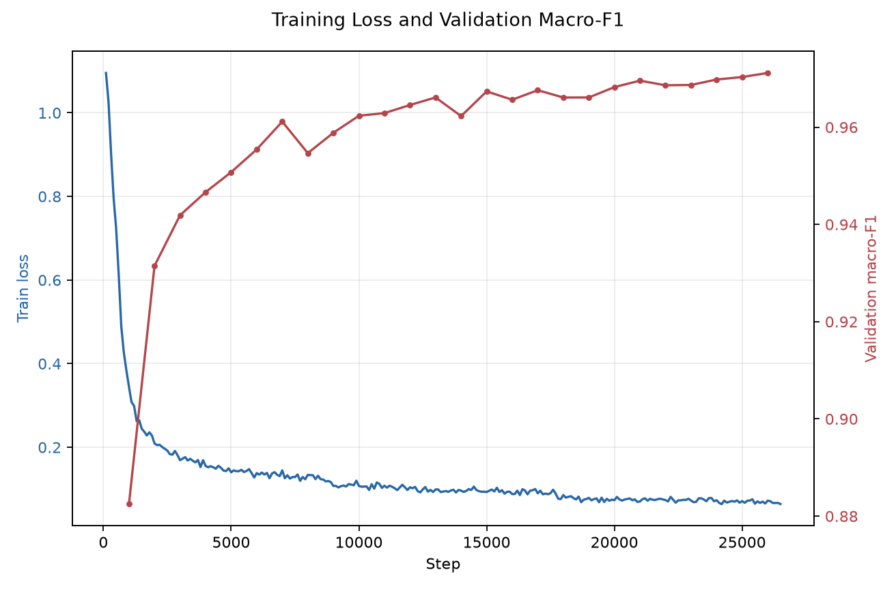

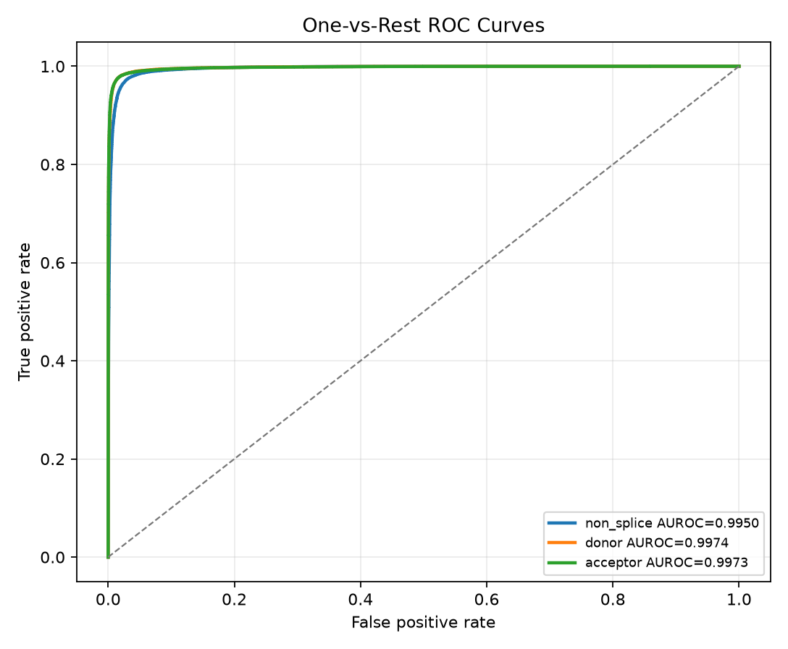

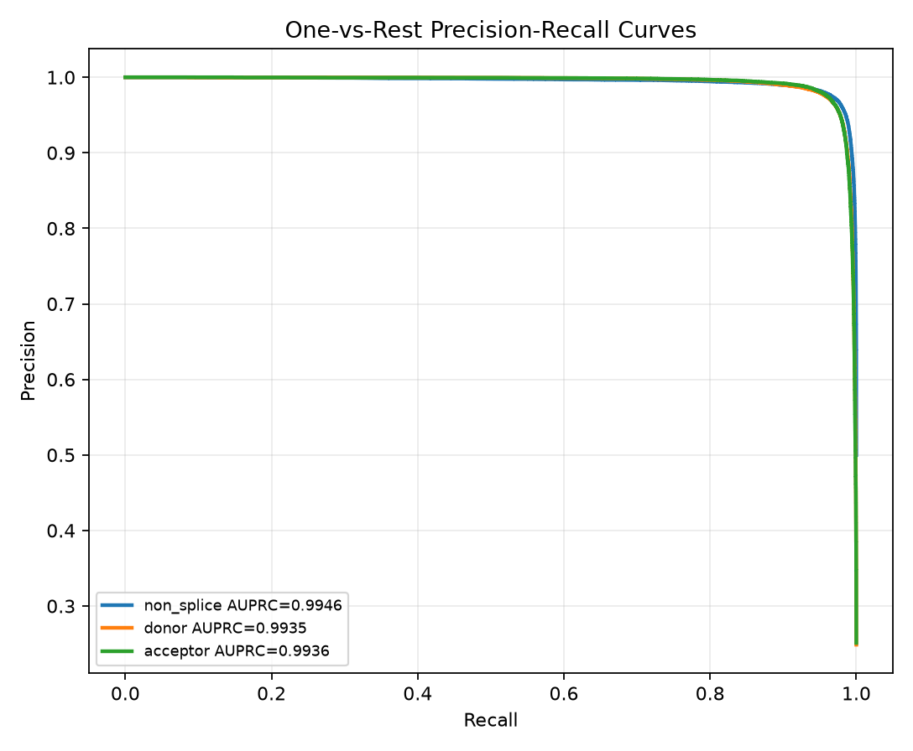

与 full baseline 在同一个原始 full test 上对比：

| 实验 | 训练负样本 | 测试集 | accuracy | macro-F1 | motif_hard FPR | intronic FPR | random_genome FPR |
|---|---|---|---:|---:|---:|---:|---:|
| full baseline | random + motif_hard + intronic | original full test | 0.966906 | 0.966328 | 0.061291 | 0.024473 | 0.029300 |
| random-only ablation | random only | original full test | 0.967033 | 0.966504 | 0.071004 | 0.032404 | 0.020989 |

整体 accuracy 与 macro-F1 变化很小，但错误结构发生了可解释变化：random-only 模型在 `random_genome` 上 false-positive rate 更低，从 2.93% 降到 2.10%；但对未见过的困难负样本更不稳，`motif_hard` FPR 从 6.13% 升到 7.10%，`intronic` FPR 从 2.45% 升到 3.24%。这说明困难负样本并不一定显著提高 overall macro-F1，却能改善更贴近真实误报风险的负样本切片。

通用 full test 的混淆矩阵为：

| true \ pred | non_splice | donor | acceptor |
|---|---:|---:|---:|
| non_splice | 67,804 | 1,543 | 1,390 |
| donor | 698 | 34,375 | 124 |
| acceptor | 753 | 156 | 34,631 |

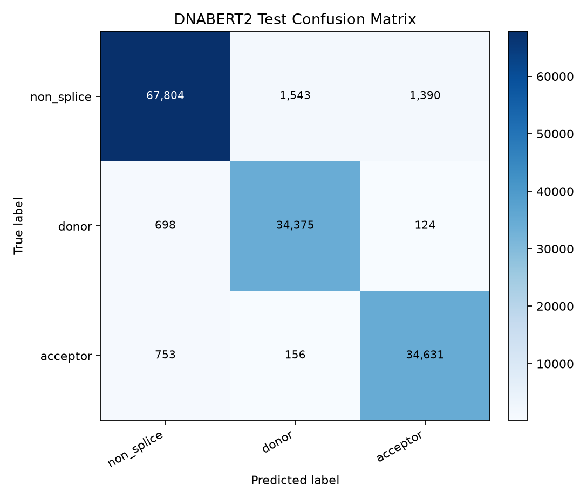

按负样本类型的详细结果如下，完整表见 [`negative_type_summary.csv`](../outputs/visualizations/dnabert2_ablation_random_only/negative_type_summary.csv)，高置信度 `motif_hard` 假阳性案例见 [`motif_hard_false_positives_top100.csv`](../outputs/visualizations/dnabert2_ablation_random_only/motif_hard_false_positives_top100.csv) 与 [`motif_hard_false_positives_top20.md`](../outputs/visualizations/dnabert2_ablation_random_only/motif_hard_false_positives_top20.md)。

| negative_type | n | accuracy | false_positive_rate | donor_fp | acceptor_fp | mean_splice_site_probability |
|---|---:|---:|---:|---:|---:|---:|
| motif_hard | 23,576 | 0.928996 | 0.071004 | 888 | 786 | 0.089953 |
| intronic | 23,577 | 0.967596 | 0.032404 | 421 | 343 | 0.046039 |
| random_genome | 23,584 | 0.979011 | 0.020989 | 234 | 261 | 0.032983 |

splice-site probability 分布显示，random-only 模型将更多 `motif_hard` 样本推入高分右尾；中心序列频率图仍显示 donor/acceptor 的 canonical motif 信号，说明性能变化主要来自负样本覆盖不足，而不是模型无法学习正样本模式。

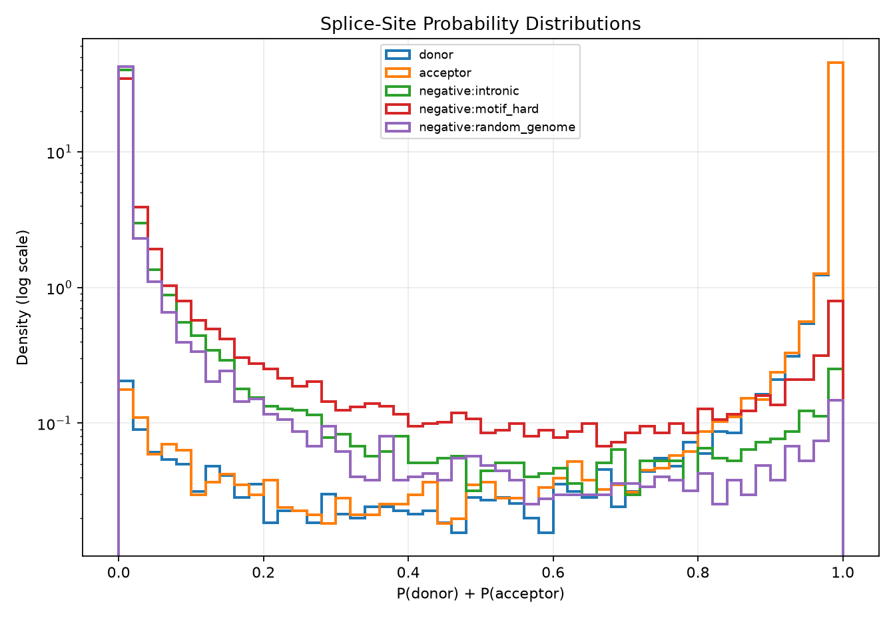

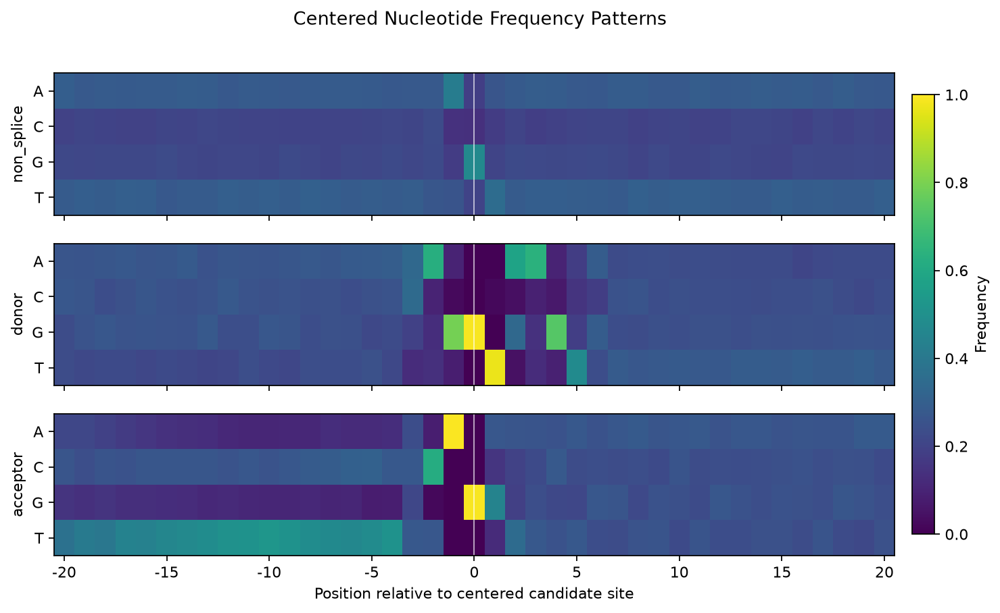

## 8. baseline 与 smoke test

### 8.1 baseline 设计

传统 baseline 位于 `src/baselines.py`。它使用：

- character n-gram TF-IDF。
- Logistic Regression。
- 默认 n-gram range：3 到 6。
- `class_weight=balanced`。

配置文件为 `configs/baseline.yaml`：

```yaml
baseline:
  ngram_range: [3, 6]
  max_features: 200000
  max_iter: 1000
  class_weight: balanced
```

当前 baseline 默认指向 smoke dataset：

```yaml
data:
  dataset_dir: data/processed/dnabert2_splice_401_smoke
```

因此 baseline 结果只用于验证传统方法流程可运行，不作为全量主实验对照。

### 8.2 smoke dataset 结果

smoke 数据构建命令：

```bash
python -m src.build_splice_dataset --config configs/dataset_smoke.yaml
```

smoke 数据统计：

| 指标 | 数值 |
|---|---:|
| transcript 数 | 250 |
| intron 数 | 1,701 |
| 总样本数 | 1,198 |
| non_splice | 599 |
| donor | 297 |
| acceptor | 302 |
| train | 718 |
| valid | 240 |
| test | 240 |

三类负样本在 smoke dataset 中均成功生成：

| negative_type | 数量 |
|---|---:|
| random_genome | 200 |
| motif_hard | 200 |
| intronic | 199 |

### 8.3 baseline smoke 结果

baseline smoke 测试集结果：

| 指标 | 数值 |
|---|---:|
| accuracy | 0.625000 |
| macro-F1 | 0.565141 |
| AUROC non_splice | 0.867639 |
| AUROC donor | 0.705684 |
| AUROC acceptor | 0.702628 |

baseline smoke per-class：

| 类别 | support | precision | recall | F1 |
|---|---:|---:|---:|---:|
| non_splice | 120 | 0.801653 | 0.808333 | 0.804979 |
| donor | 59 | 0.510204 | 0.423729 | 0.462963 |
| acceptor | 61 | 0.400000 | 0.459016 | 0.427481 |

该结果只说明 TF-IDF + logistic regression 代码可跑通，并能输出完整指标。由于样本量很小，不能直接与全量 DNABERT2 结果比较。

### 8.4 DNABERT2 smoke 训练

DNABERT2 smoke 训练命令：

```bash
python -m src.train_dnabert2 --config configs/dnabert2_smoke.yaml
```

smoke 训练配置中：

- 每个 split 最多 8 条样本。
- `max_steps = 2`。
- batch size = 2。
- 目的只是验证 tokenizer、model、Trainer、保存路径、metrics 流程能启动。

因此 smoke 训练分数不作为模型效果结论。主结论以 `outputs/dnabert2_full` 的全量训练结果为准。

## 9. 代码结构与实现说明

### 9.1 目录结构

项目整理后的主要结构：

```text
configs/
  baseline.yaml
  dataset.yaml
  dataset_smoke.yaml
  dnabert2_full.yaml
  dnabert2_smoke.yaml
data/
  raw/
  processed/
docs/
  splice_site_report .docx
  dnabert2_splice_site_project_report.md
outputs/
src/
  __init__.py
  baselines.py
  build_splice_dataset.py
  config_utils.py
  evaluate.py
  gtf_utils.py
  metrics_utils.py
  model_utils.py
  predict.py
  sequence_utils.py
  split_dataset.py
  train_dnabert2.py
  visualize.ipynb
```

`src/import os.py` 是历史参考文件，不作为新主流程入口。

### 9.2 核心模块职责

| 文件 | 职责 |
|---|---|
| `src/sequence_utils.py` | FASTA 打开、染色体名匹配、窗口截取、坐标转换、reverse complement、DNA 序列过滤、中心 motif 检查 |
| `src/gtf_utils.py` | GTF attribute 解析、exon 分组、transcript-level intron 推导、正样本位点生成、正样本去重 |
| `src/build_splice_dataset.py` | 正负样本构建、窗口抽取、负样本采样、分层划分、DatasetDict/Parquet/summary 输出 |
| `src/train_dnabert2.py` | DNABERT2 tokenizer/model 加载、三分类 full fine-tuning、checkpoint/final model/metrics/predictions 输出 |
| `src/metrics_utils.py` | accuracy、macro-F1、per-class 指标、confusion matrix、AUROC、AUPRC |
| `src/evaluate.py` | 从 prediction parquet/csv/jsonl 统一计算 overall 与 negative_type 分组指标 |
| `src/predict.py` | 给定 FASTA、chrom、pos、strand 和模型目录，进行单点推理 |
| `src/predict_dataset.py` | 使用已训练模型对任意 parquet/jsonl/csv 数据集批量推理，并可直接输出指标 |
| `src/baselines.py` | char k-mer TF-IDF + logistic regression baseline |
| `src/model_utils.py` | DNABERT2 remote code 兼容处理，禁用不兼容 flash attention，保存 remote model code |
| `src/config_utils.py` | YAML 读取、随机种子、日志、JSON 写入、目录创建 |
| `src/visualize.py` | ROC/PR、混淆矩阵、训练曲线、概率分布、中心序列频率和 motif-hard 假阳性案例可视化 |

### 9.3 数据构建主流程伪代码

```text
load dataset config
set random seed
open FASTA with pyfaidx
parse GTF exon records grouped by transcript_id
derive transcript-level introns
generate donor/acceptor positive site records
deduplicate positives by chrom, pos, strand, site_type
extract oriented 401 bp windows for positives
build known splice-site index
sample random_genome negatives
sample motif_hard negatives
sample intronic negatives
merge positives and negatives
shuffle
create stratify_key
split train/valid/test
save HuggingFace DatasetDict
save train/valid/test parquet
save summary.json
```

### 9.4 训练主流程伪代码

```text
load training config
set random seed
log CUDA and distributed runtime
load processed DatasetDict
load DNABERT2 tokenizer
tokenize raw DNA sequence directly
load DNABERT2 sequence classification model with num_labels=3
disable incompatible remote Triton flash attention
construct TrainingArguments
construct Trainer
train
save final model and tokenizer
evaluate valid split
predict test split
save test_predictions.parquet
save metrics.json and test_metrics.json
```

## 10. 运行与复现方法

### 10.1 环境创建

推荐使用 conda：

```bash
conda env create -f environment.yml
conda activate dna-fine-tune
```

环境名固定为：

```text
dna-fine-tune
```

`environment.yml` 中核心依赖包括：

- Python 3.11
- PyTorch
- transformers
- datasets
- accelerate
- scikit-learn
- pandas
- numpy
- pyfaidx
- tqdm
- PyYAML
- pyarrow
- matplotlib
- joblib
- einops

如果 CUDA wheel 与服务器不匹配，可先根据 PyTorch 官方安装方式安装合适版本，再执行：

```bash
pip install -r requirements.txt
```

### 10.2 GPU 检查

激活环境后可检查 PyTorch 和 CUDA：

```bash
python - <<'PY'
import torch
print(torch.__version__)
print(torch.version.cuda)
print(torch.cuda.is_available())
print(torch.cuda.device_count())
for i in range(torch.cuda.device_count()):
    print(i, torch.cuda.get_device_name(i))
PY
```

也可使用：

```bash
nvidia-smi
```

### 10.3 构建 smoke 数据集

```bash
python -m src.build_splice_dataset --config configs/dataset_smoke.yaml
```

输出：

```text
data/processed/dnabert2_splice_401_smoke/
```

该步骤用于快速验证：

- GTF exon 可解析。
- transcript-level intron 可推导。
- FASTA 能截取 401 bp。
- 负链 reverse complement 逻辑可运行。
- 三类负样本都能生成。
- train/valid/test 能成功保存。

### 10.4 运行 baseline smoke

```bash
python -m src.baselines --config configs/baseline.yaml
```

输出：

```text
outputs/baseline_smoke/
```

包括：

- `metrics.json`
- `valid_predictions.parquet`
- `test_predictions.parquet`
- `tfidf_logreg.joblib`

### 10.5 运行 DNABERT2 smoke 训练

```bash
python -m src.train_dnabert2 --config configs/dnabert2_smoke.yaml
```

输出：

```text
outputs/dnabert2_smoke/
```

该步骤验证：

- DNABERT2 tokenizer 能处理 401 bp DNA 字符串。
- DNABERT2 sequence classification model 能加载。
- Trainer 能启动。
- metrics 和 predictions 能保存。

### 10.6 构建全量数据集

```bash
python -m src.build_splice_dataset --config configs/dataset.yaml
```

实际会生成：

```text
data/processed/dnabert2_splice_401/
```

关键验收文件：

```text
data/processed/dnabert2_splice_401/dataset_dict.json
data/processed/dnabert2_splice_401/summary.json
data/processed/dnabert2_splice_401/train.parquet
data/processed/dnabert2_splice_401/valid.parquet
data/processed/dnabert2_splice_401/test.parquet
```

### 10.7 启动全量 DNABERT2 full fine-tuning

单进程形式：

```bash
python -m src.train_dnabert2 --config configs/dnabert2_full.yaml
```

两张 GPU 多进程形式：

```bash
torchrun --nproc_per_node=2 -m src.train_dnabert2 --config configs/dnabert2_full.yaml
```

本项目实际使用的完整命令：

```bash
PYTORCH_CUDA_ALLOC_CONF=expandable_segments:True \
HF_HOME=/home/ubuntu/clin-jepa/final-project/.cache/huggingface \
conda run --no-capture-output -n dna-fine-tune \
torchrun --nproc_per_node=2 -m src.train_dnabert2 --config configs/dnabert2_full.yaml
```

输出目录：

```text
outputs/dnabert2_full/
```

关键验收文件：

```text
outputs/dnabert2_full/final_model/model.safetensors
outputs/dnabert2_full/metrics.json
outputs/dnabert2_full/test_metrics.json
outputs/dnabert2_full/test_predictions.parquet
```

### 10.8 构建与训练 chromosome-held-out 实验

若复用已经构建好的全量随机 split parquet，可直接重新切分为 chromosome-held-out 数据集：

```bash
python -m src.split_dataset \
  --config configs/dataset_chrom_holdout.yaml \
  --input data/processed/dnabert2_splice_401/train.parquet \
          data/processed/dnabert2_splice_401/valid.parquet \
          data/processed/dnabert2_splice_401/test.parquet \
  --output_dir data/processed/dnabert2_splice_401_chrom_holdout
```

训练命令：

```bash
torchrun --nproc_per_node=2 -m src.train_dnabert2 \
  --config configs/dnabert2_chrom_holdout_full.yaml
```

输出目录：

```text
outputs/dnabert2_chrom_holdout_full/
```

可视化命令：

```bash
python -m src.visualize \
  --predictions outputs/dnabert2_chrom_holdout_full/test_predictions.parquet \
  --trainer_state outputs/dnabert2_chrom_holdout_full/checkpoints/trainer_state.json \
  --output_dir outputs/visualizations/dnabert2_chrom_holdout_full \
  --title dnabert2_chrom_holdout_full
```

### 10.9 构建与训练 random-only 负样本消融实验

random-only 数据集从 raw FASTA/GTF 重新构建，只启用 `random_genome` 负样本：

```bash
python -m src.build_splice_dataset \
  --config configs/dataset_random_only.yaml
```

训练命令：

```bash
torchrun --nproc_per_node=2 -m src.train_dnabert2 \
  --config configs/dnabert2_ablation_random_only.yaml
```

该训练会输出 random-only 自身 test 的 `test_metrics.json` 与 `test_predictions.parquet`。为了检验困难负样本泛化能力，再用训练好的模型对原始 full test 推理：

```bash
python -m src.predict_dataset \
  --model_dir outputs/dnabert2_ablation_random_only/final_model \
  --input data/processed/dnabert2_splice_401/test.parquet \
  --output outputs/dnabert2_ablation_random_only/full_test_predictions.parquet \
  --metrics_output outputs/dnabert2_ablation_random_only/full_test_metrics.json \
  --batch_size 256 \
  --max_length 512
```

可视化命令使用原始 full test 的预测文件：

```bash
python -m src.visualize \
  --predictions outputs/dnabert2_ablation_random_only/full_test_predictions.parquet \
  --trainer_state outputs/dnabert2_ablation_random_only/checkpoints/trainer_state.json \
  --output_dir outputs/visualizations/dnabert2_ablation_random_only \
  --title dnabert2_ablation_random_only_common_full_test
```

### 10.10 统一评估

```bash
python -m src.evaluate \
  --predictions outputs/dnabert2_full/test_predictions.parquet \
  --output outputs/dnabert2_full/eval_metrics.json
```

该命令会输出 overall metrics 和按 `negative_type` 分组的负样本指标。

### 10.11 单点预测

```bash
python -m src.predict \
  --model_dir outputs/dnabert2_full/final_model \
  --fasta data/raw/GRCh38.p14.genome.fa \
  --chrom chr1 \
  --pos 123456 \
  --strand +
```

参数说明：

| 参数 | 含义 |
|---|---|
| `--model_dir` | 保存好的模型目录 |
| `--fasta` | 参考基因组 FASTA |
| `--chrom` | 染色体名 |
| `--pos` | 1-based 中心位置 |
| `--strand` | `+` 或 `-`，决定是否 reverse complement |
| `--window_size` | 默认 401 |

输出为 JSON，包含：

- `chrom`
- `pos`
- `strand`
- `window_start`
- `window_end`
- `sequence`
- `probabilities`
- `splice_site_probability`
- `pred_label`

## 11. 超参数与设计 rationale

### 11.1 为什么使用 401 bp window

401 bp window 对应中心位点上下游各 200 bp。选择奇数长度的原因是可以保证候选位置严格位于中心。相比 100 bp 或 201 bp，401 bp 能给模型更多上下文，有助于识别剪接位点附近的 sequence pattern；相比更长窗口，401 bp 又能控制显存与计算成本，并适配 DNABERT2 `max_length=512` 的 tokenization 设置。

### 11.2 为什么做三分类而不是二分类

旧版方案将 donor 与 acceptor 合并为 splice site，做二分类。新版方案使用三分类，优势是：

- donor 与 acceptor 在生物学功能和序列模式上不同。
- 三分类能直接输出 donor probability 与 acceptor probability。
- 合并概率 `P(donor)+P(acceptor)` 仍可得到二分类意义上的 splice-site probability。
- 后续可分别分析 donor 和 acceptor 的错误类型。

### 11.3 为什么使用 transcript-level intron 而不是 exon 端点

仅使用 exon 起点/终点会把 transcript 首末 exon 的外侧边界混入，这些边界不一定对应 intron splice junction。transcript-level intron 推导能确保正样本来自相邻 exon 之间的真实 intron 两端，更符合剪接位点定义。

### 11.4 为什么保留困难负样本

如果只使用随机背景负样本，模型可能学到非常简单的规则。例如，中心是否有 GT/AG、是否位于基因附近、GC content 是否异常等。引入 `motif_hard` 和 `intronic` 可以提高任务难度，使模型必须学习更细致的上下文模式。

random-only 消融验证了这一判断。只用 `random_genome` 训练时，模型在随机负样本测试集上表现更高，但放回包含困难负样本的原始 full test 后，`motif_hard` false-positive rate 从 full baseline 的 6.13% 升至 7.10%。因此困难负样本不是单纯增加数据多样性，而是在约束模型不要把局部 GT/AG motif 直接当作剪接位点。

### 11.5 为什么使用随机分层划分

首版目标是完成可运行的全基因组三分类 DNABERT2 项目。随机分层划分的优点是：

- 实现简单。
- 类别比例稳定。
- 训练、验证、测试都能覆盖三类负样本。
- 适合作为首版模型开发和 smoke/full pipeline 验证。

但随机划分会让同源或相近 genomic context 在不同 split 间共享，不能完全衡量跨染色体泛化能力。因此本轮扩展增加了 chromosome-held-out split，并用 `chr8` validation、`chr9/chr10` test 复训 full fine-tuning 模型。该实验用于检验随机 split 结果是否严重依赖同染色体上下文。

## 12. 局限性

### 12.1 chromosome-held-out 仍只是单组留出

本轮已经完成 `chr8` validation、`chr9/chr10` test 的 chromosome-held-out full fine-tuning，并且没有观察到相对随机分层 baseline 的明显性能下降。但这仍只是单组染色体留出，不能覆盖所有 chromosome 的 GC content、基因密度、重复序列和注释密度差异。更稳健的泛化结论应进一步做多组 chromosome fold 或 leave-chromosome-group-out 交叉验证。

### 12.2 负样本仍依赖 annotation 完整性

负样本通过远离 GENCODE 注释 splice site 来降低假阴性风险。但 GENCODE 并不一定覆盖所有细胞类型、所有条件下的真实剪接事件。因此部分“负样本”可能是未注释或低置信度剪接位点。

### 12.3 类别比例不代表真实基因组先验

训练集中负样本总量被设置为正样本总量的 1 倍，形成近似 1:1 的 splice vs non-splice 比例。但真实基因组中非剪接位置远多于剪接位置。因此模型输出概率在真实全基因组扫描场景中可能需要额外校准。

### 12.4 当前没有阈值校准

项目输出三类概率和 splice-site probability，但尚未针对具体应用场景选择阈值。例如，如果任务目标是高召回扫描候选变异附近 splice disruption，阈值可能应偏低；如果目标是高精度注释候选剪接位点，阈值可能应偏高。

### 12.5 当前没有外部验证集

当前评估仍基于同一 GENCODE v49 basic annotation 构建流程。即使 chromosome-held-out 消除了 train/test 染色体重叠，也无法证明模型能推广到其他 annotation 版本、MANE transcript、实验验证 splice junction、RNA-seq junction evidence 或疾病变异数据。

### 12.6 没有做参数高效微调对照

本项目首版采用 full fine-tuning。尚未比较：

- frozen DNABERT2 embedding + linear probe。
- LoRA。
- adapter。
- 只训练分类头。

这些实验可以帮助分析 full fine-tuning 的收益与成本。

### 12.7 负样本消融仍只是第一组对照

本轮已完成 `random_genome` only 与三类负样本全量之间的第一组对照，说明困难负样本能降低 `motif_hard` 与 `intronic` 假阳性。不过这仍不是完整网格。更系统的消融还应比较：

- random_genome + intronic。
- random_genome + motif_hard。
- 不同比例的 motif_hard/intronic。
- 更严格的 motif-hard 采样半径和近剪接位点排除规则。

这类消融有助于把“困难负样本覆盖”与“负样本总量”分开，进一步量化不同负样本来源的边际贡献。

## 13. 扩展实验进展与后续方向

### 13.1 chromosome-held-out split

本轮已实现并完成第一组 chromosome-held-out full fine-tuning。配置为：

```yaml
split:
  strategy: chromosome_holdout
  valid_chroms: [chr8]
  test_chroms: [chr9, chr10]
```

对应数据集为 `data/processed/dnabert2_splice_401_chrom_holdout/`，模型输出为 `outputs/dnabert2_chrom_holdout_full/`，可视化输出为 `outputs/visualizations/dnabert2_chrom_holdout_full/`。该实验的 held-out test macro-F1 为 0.966799，与随机分层 baseline 的 0.966328 基本一致。后续更有价值的扩展不是重复同一组染色体，而是加入更多 chromosome folds。

### 13.2 LoRA 与 linear probe

实现新的训练配置：

- `dnabert2_lora.yaml`
- `dnabert2_linear_probe.yaml`

比较指标：

- macro-F1。
- AUROC/AUPRC。
- 显存占用。
- 训练时间。
- checkpoint 大小。

### 13.3 负样本消融

本轮已实现通过 `negatives.enabled_types` 切换训练负样本类型，并完成 random-only 全量训练：

```yaml
negatives:
  enabled_types: [random_genome]
```

对应数据集为 `data/processed/dnabert2_splice_401_random_only/`，模型输出为 `outputs/dnabert2_ablation_random_only/`，可视化输出为 `outputs/visualizations/dnabert2_ablation_random_only/`。该模型在自身 random-only test 上 macro-F1 为 0.972705，但在原始 full test 上 macro-F1 为 0.966504，且 `motif_hard` false-positive rate 为 0.071004，高于 full baseline 的 0.061291。

因此当前结论是：random-only 负样本足以训练出整体三分类能力，但会削弱对 GT/AG motif-hard 负样本的控制。后续应继续比较：

- random_genome + intronic。
- random_genome + motif_hard。
- 不同 negative:positive ratio。
- motif-hard 采样规则和距离过滤强度。

### 13.4 可视化分析

本轮已新增 `src/visualize.py`，并完成 baseline、chromosome-held-out 与 random-only ablation 三组可视化：

- ROC curve。
- PR curve。
- confusion matrix heatmap。
- 训练 loss 和 eval macro-F1 曲线。
- 中心序列频率图。
- splice-site probability 分布。
- negative-type summary。
- motif_hard 高置信度假阳性案例表。

新增目录包括：

- `outputs/visualizations/dnabert2_full_baseline/`
- `outputs/visualizations/dnabert2_chrom_holdout_full/`
- `outputs/visualizations/dnabert2_ablation_random_only/`

仍未完成但值得加入的解释性分析包括 DNABERT2 embedding UMAP/t-SNE、gradient/attention attribution heatmap、以及按基因 biotype 或重复序列区域分层的错误分析。

### 13.5 概率校准与阈值选择

可在 validation set 上进行：

- temperature scaling。
- reliability diagram。
- expected calibration error。
- donor/acceptor 分别阈值选择。
- splice-site probability 二分类阈值选择。

### 13.6 变异效应预测

当前模型预测单个位置是否像剪接位点。后续可扩展到 variant effect：

1. 对参考 allele 构建窗口并预测。
2. 对替代 allele 构建窗口并预测。
3. 比较 donor/acceptor/splice-site probability 变化。
4. 识别可能破坏或新建剪接位点的变异。

### 13.7 外部数据验证

可引入：

- RNA-seq junction evidence。
- ClinVar splice-altering variants。
- GTEx tissue-specific splice junction。
- MANE Select transcript。
- 不同 GENCODE 版本之间的 held-out annotation。

这些验证可以评估模型是否只拟合 GENCODE v49 basic annotation，还是能推广到更多真实生物学场景。

## 14. 结论

本项目已经从旧版历史参考脚本重构为一个模块化、可在 GPU 服务器上运行的 DNABERT2 剪接位点预测项目。新方案围绕全基因组、401 bp transcript-oriented window、三分类、困难负样本、DNABERT2 full fine-tuning 构建，覆盖了从 GTF/FASTA 数据解析到模型训练、评估、预测的完整流程。

与旧版二分类 chr1 子集方案相比，本项目有以下核心改进：

- 数据范围从 chr1 子集扩展到全基因组。
- 正样本从 exon 端点启发式改为 transcript-level intron 推导。
- 任务从二分类升级为 donor/acceptor/non_splice 三分类。
- 输入窗口从较短窗口扩展为 401 bp。
- 负链序列统一 reverse complement 到转录方向。
- 负样本从随机背景扩展为 random_genome、motif_hard、intronic 三类。
- 模型从旧 DNABERT k-mer tokenizer 方案升级为 DNABERT2 原始 DNA 输入。
- 训练从本地小规模实验升级为双 GPU full fine-tuning。
- 输出包括可复用 DatasetDict、Parquet、metrics JSON、prediction parquet、final model、CLI 推理接口和独立可视化目录。
- 扩展实验增加了 chromosome-held-out split，并完成对应 full fine-tuning、测试评估和可视化。
- 扩展实验增加了 random-only 负样本消融，并用原始 full test 复评困难负样本泛化。

随机分层全量测试集结果显示，模型达到 accuracy 0.966906、macro-F1 0.966328，donor 与 acceptor 召回率均超过 0.970，说明 DNABERT2 能有效学习剪接位点上下文特征。chromosome-held-out 实验在 `chr9/chr10` test 上达到 accuracy 0.967469、macro-F1 0.966799，说明在当前留出方案下没有观察到明显跨染色体性能退化。random-only 消融在自身测试集上 macro-F1 为 0.972705，但在原始 full test 上 `motif_hard` false-positive rate 升至 7.10%，进一步证明困难负样本对假阳性控制有必要价值。

总体而言，本项目已经满足课程任务中“基于 DNA foundation model 构建基因剪接位点预测算法”的要求，并提供了清晰的输入输出说明、完整源码结构、可复现运行命令、实测验证结果和可视化分析。后续可继续围绕更多 chromosome folds、参数高效微调、负样本比例网格、可视化解释和外部数据验证开展扩展实验。

## 附录 A. 主要命令汇总

### 环境

```bash
conda env create -f environment.yml
conda activate dna-fine-tune
```

### smoke 数据

```bash
python -m src.build_splice_dataset --config configs/dataset_smoke.yaml
```

### baseline

```bash
python -m src.baselines --config configs/baseline.yaml
```

### DNABERT2 smoke

```bash
python -m src.train_dnabert2 --config configs/dnabert2_smoke.yaml
```

### 全量数据构建

```bash
python -m src.build_splice_dataset --config configs/dataset.yaml
```

### 全量训练

```bash
torchrun --nproc_per_node=2 -m src.train_dnabert2 --config configs/dnabert2_full.yaml
```

### chromosome-held-out 数据与训练

```bash
python -m src.split_dataset \
  --config configs/dataset_chrom_holdout.yaml \
  --input data/processed/dnabert2_splice_401/train.parquet \
          data/processed/dnabert2_splice_401/valid.parquet \
          data/processed/dnabert2_splice_401/test.parquet \
  --output_dir data/processed/dnabert2_splice_401_chrom_holdout

torchrun --nproc_per_node=2 -m src.train_dnabert2 \
  --config configs/dnabert2_chrom_holdout_full.yaml
```

### random-only 负样本消融

```bash
python -m src.build_splice_dataset --config configs/dataset_random_only.yaml

torchrun --nproc_per_node=2 -m src.train_dnabert2 \
  --config configs/dnabert2_ablation_random_only.yaml

python -m src.predict_dataset \
  --model_dir outputs/dnabert2_ablation_random_only/final_model \
  --input data/processed/dnabert2_splice_401/test.parquet \
  --output outputs/dnabert2_ablation_random_only/full_test_predictions.parquet \
  --metrics_output outputs/dnabert2_ablation_random_only/full_test_metrics.json \
  --batch_size 256 \
  --max_length 512
```

### 可视化

```bash
python -m src.visualize \
  --predictions outputs/dnabert2_full/test_predictions.parquet \
  --trainer_state outputs/dnabert2_full/checkpoints/trainer_state.json \
  --output_dir outputs/visualizations/dnabert2_full_baseline \
  --title dnabert2_full_baseline
```

### 最终评估

```bash
python -m src.evaluate \
  --predictions outputs/dnabert2_full/test_predictions.parquet \
  --output outputs/dnabert2_full/eval_metrics.json
```

### 单点预测

```bash
python -m src.predict \
  --model_dir outputs/dnabert2_full/final_model \
  --fasta data/raw/GRCh38.p14.genome.fa \
  --chrom chr1 \
  --pos 123456 \
  --strand +
```

## 附录 B. 配置文件说明

| 配置文件 | 用途 |
|---|---|
| `configs/dataset.yaml` | 全量数据集构建 |
| `configs/dataset_chrom_holdout.yaml` | chromosome-held-out split 构建 |
| `configs/dataset_random_only.yaml` | random-only 负样本消融数据集构建 |
| `configs/dataset_smoke.yaml` | 小规模数据构建 smoke test |
| `configs/dnabert2_full.yaml` | DNABERT2 full fine-tuning |
| `configs/dnabert2_chrom_holdout_full.yaml` | chromosome-held-out DNABERT2 full fine-tuning |
| `configs/dnabert2_ablation_random_only.yaml` | random-only 负样本消融 DNABERT2 full fine-tuning |
| `configs/dnabert2_smoke.yaml` | DNABERT2 极小训练 smoke test |
| `configs/baseline.yaml` | TF-IDF + logistic regression baseline |

## 附录 C. 输出文件说明

### 数据集输出

| 文件 | 说明 |
|---|---|
| `data/processed/dnabert2_splice_401/dataset_dict.json` | HuggingFace DatasetDict 元信息 |
| `data/processed/dnabert2_splice_401/train.parquet` | train split |
| `data/processed/dnabert2_splice_401/valid.parquet` | valid split |
| `data/processed/dnabert2_splice_401/test.parquet` | test split |
| `data/processed/dnabert2_splice_401/summary.json` | 数据构建 summary |
| `data/processed/dnabert2_splice_401_chrom_holdout/split_summary.json` | chromosome-held-out split 审计 |
| `data/processed/dnabert2_splice_401_chrom_holdout/valid.parquet` | `chr8` validation split |
| `data/processed/dnabert2_splice_401_chrom_holdout/test.parquet` | `chr9/chr10` test split |
| `data/processed/dnabert2_splice_401_random_only/summary.json` | random-only 数据构建 summary |
| `data/processed/dnabert2_splice_401_random_only/test.parquet` | random-only test split |

### 模型输出

| 文件 | 说明 |
|---|---|
| `outputs/dnabert2_full/final_model/model.safetensors` | fine-tuned 模型权重 |
| `outputs/dnabert2_full/final_model/config.json` | 模型配置 |
| `outputs/dnabert2_full/final_model/tokenizer.json` | tokenizer |
| `outputs/dnabert2_full/metrics.json` | train/valid/test 指标 |
| `outputs/dnabert2_full/test_metrics.json` | test 指标 |
| `outputs/dnabert2_full/test_predictions.parquet` | 测试集逐样本预测 |
| `outputs/dnabert2_full/eval_metrics.json` | 统一评估输出 |
| `outputs/dnabert2_chrom_holdout_full/metrics.json` | chromosome-held-out train/valid/test 指标 |
| `outputs/dnabert2_chrom_holdout_full/test_predictions.parquet` | chromosome-held-out 测试集逐样本预测 |
| `outputs/dnabert2_ablation_random_only/metrics.json` | random-only train/valid/test 指标 |
| `outputs/dnabert2_ablation_random_only/test_predictions.parquet` | random-only 自身测试集逐样本预测 |
| `outputs/dnabert2_ablation_random_only/full_test_metrics.json` | random-only 模型在原始 full test 上的指标 |
| `outputs/dnabert2_ablation_random_only/full_test_predictions.parquet` | random-only 模型在原始 full test 上的逐样本预测 |
| `outputs/visualizations/dnabert2_full_baseline/` | 随机分层 full baseline 可视化目录 |
| `outputs/visualizations/dnabert2_chrom_holdout_full/` | chromosome-held-out full 可视化目录 |
| `outputs/visualizations/dnabert2_ablation_random_only/` | random-only 消融可视化目录 |

## 附录 D. 关键源码片段说明

### D.1 窗口截取与坐标转换

`src/sequence_utils.py` 中的 `get_centered_window` 负责：

- 检查 `window_size` 是否为奇数。
- 检查 `strand` 是否为 `+` 或 `-`。
- 根据中心位置计算 1-based inclusive 窗口。
- 转换为 pyfaidx 0-based half-open 切片。
- 检查窗口长度是否等于 401。
- 对负链序列做 reverse complement。

### D.2 transcript-level intron 推导

`src/gtf_utils.py` 中的 `transcript_introns` 负责：

- 确认 transcript 内 exon 数至少为 2。
- 确认 exon 在同一 chromosome 和 strand。
- 按 strand 对应的转录方向排序。
- 从相邻 exon 的 gap 生成 intron。

### D.3 正样本构造

`positive_site_records` 根据 strand 决定 donor 和 acceptor 锚点：

| strand | donor | acceptor |
|---|---|---|
| `+` | intron start | intron end |
| `-` | intron end | intron start |

### D.4 负样本构造

`make_negative_record` 统一处理负样本候选位置：

- 检查是否重复。
- 检查是否靠近已知剪接位点。
- 截取 401 bp window。
- 检查是否只包含 A/C/G/T。
- 如果是 motif_hard，检查中心附近是否存在 GT/AG motif。
- 保存元数据与 sequence。

### D.5 训练评估

`src/train_dnabert2.py` 中：

- `tokenize_dataset` 直接 tokenize raw DNA。
- `compute_metrics` 调用统一指标函数。
- `preprocess_logits_for_metrics` 避免 Trainer 在评估时缓存过大的额外张量。
- `save_predictions` 保存 test set 概率、预测 label 和 splice-site probability。

## 附录 E. 本报告与旧 docx 的关系

仓库中保留了历史报告：

```text
docs/splice_site_report .docx
```

该文档描述的是旧版实验：chr1 范围、二分类、旧 DNABERT、手动 k-mer tokenization、小规模训练。它对课程报告结构有参考价值，但不代表当前最终项目方案。

本报告对应的是当前仓库的重构后方案：

- 全基因组数据构建。
- transcript-level intron 正样本。
- 401 bp window。
- 三分类。
- 三类负样本。
- DNABERT2 full fine-tuning。
- 双 GPU 全量训练。
- 已保存最终模型和测试集预测。

因此，若课程提交需要说明最终实现，应以本 Markdown 报告和当前源码为准。
